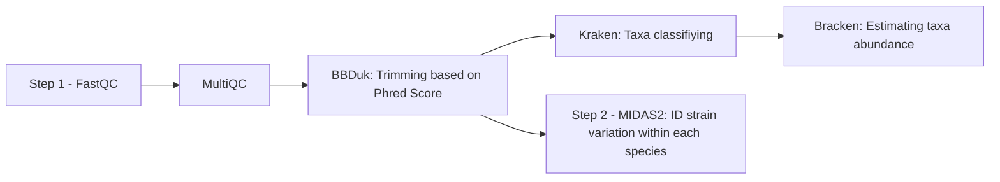

# Meta-analysis Pipeline at Strain Levels from Shotgun MetaG 

## Project Description:
The project aims to build a reproducible metagenomic pipeline to identify strain-specific changes in type 2 diabetes gut microbiome and metformin treatment.

## Research Questions:
Here we define strain changes as either 
1) Single nucleotide polymorphism (SNPs) within gene of a species AND/OR
2) Changes in gene presence and absence (aka function gain or loss) via copy number variants (CNV) of that gene in a species.
With that goal in mind, we build a workflow with two main steps:
- The first step is to identify differential abundance changes of all species in diabetic condition and treatment.
- With those changed species in mind, the second step is to see if these species also have strains that vary among different sample groups based on the definition mentioned above.

## Result Figure:
At the end of step 1, we identify a list of significant species that we cross-compared with literature (upper figure), before they are grouped into phylum level (lower)

## Conclusion:

## Citations:
